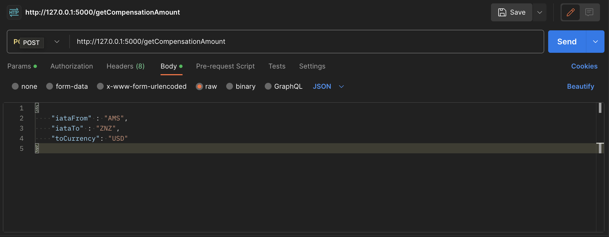

# CompensationCalculator
Quick Start:

Local Development
1. Navigate to app directory in your terminal
2. Use the command - pip3 install -r requirements.txt
3. Rename the .env.example to .env
4. Fill in the rapid api key in the .env file. (This is not needed in dev_mode, it will use the exampleflight.json instead)
5. Use the command - flask run

Endpoint: http://127.0.0.1:5000/getCompensationAmount

Docker
1. Rename the .env.example to .env
2. Fill in the rapid api key in the .env file. (This is not needed in dev_mode, it will use the exampleflight.json instead)
3. In the root directory use the command - docker build -t co2calc . 
2. After the build is complete run the command - docker run -p 8080:8080 co2calc

Endpoint: http://0.0.0.0:8080/getCompensationAmount

Example Request

Resources:
List with currencies: https://fxratesapi.com/docs/currency-list 

List with IATA codes: https://www.nationsonline.org/oneworld/IATA_Codes/airport_code_list.htm
