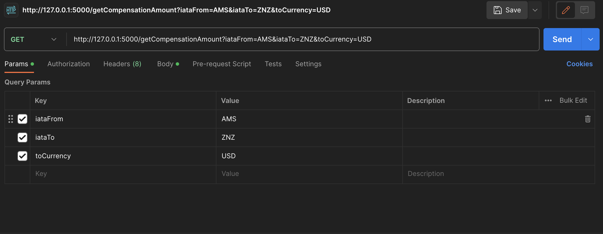

# CompensationCalculator
Python 3.12.0

Quick Start:

Local Development
1. In the root directory create a venv with the command - python3 -m venv .venv  
2. In vscode switch the interperter to venv
3. Run the command - source .venv/bin/activate
4. Run the command - pip3 install -r requirements.txt
5. Run the command - flask run

Endpoint: http://127.0.0.1:5000/getCompensationAmount

Docker
1. Rename docker-compose.yml.example
2. Run - docker-compose build   
3. Run - docker-compose up -d

Endpoint: localhost/getCompensationAmount

Example Request

Resources:
List of currencies: https://fxratesapi.com/docs/currency-list 

List of IATA codes: https://www.nationsonline.org/oneworld/IATA_Codes/airport_code_list.htm
                    https://github.com/jbrooksuk/JSON-Airports/blob/master/airports.json
