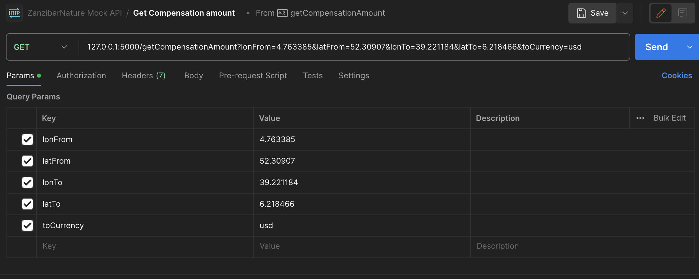

# CompensationCalculator
Python 3.12.0

Quick Start:

Local Development
1. In the root directory create a venv with the command - python3 -m venv .venv  
2. In vscode switch the interperter to venv
3. Run the command - source .venv/bin/activate
2. Run the command - pip3 install -r requirements.txt
3. Rename the .env.example to .env
4. Fill in the rapid api key in the .env file. (This is not needed in dev_mode, it will use the exampleflight.json instead)
5. Run the command - flask run

Endpoint: http://127.0.0.1:5000/getCompensationAmount

Docker
1. Rename docker-compose.yml.example
2. Fill in the rapid-api key in the docker-compose file
3. Run - docker-compose build 
4. Run - docker-compose up -d

Endpoint: localhost/getCompensationAmount

Example Request

Resources:
List of currencies: https://fxratesapi.com/docs/currency-list 

List of IATA codes: https://www.nationsonline.org/oneworld/IATA_Codes/airport_code_list.htm
